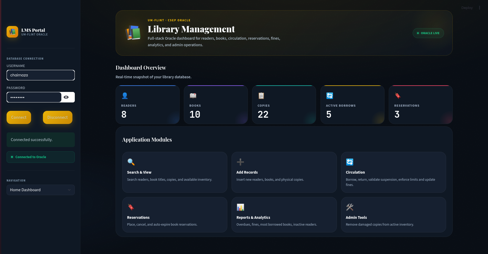

# 📚 Library Management System (LMS)

## 📌 Project Overview
This project is a **full-stack database-driven Library Management System (LMS)** developed for **CSC 584 – Database Design (Winter 2026)**.

The system provides an interactive interface to manage:
- Readers (members)
- Books and physical copies
- Borrowing and return transactions
- Reservations
- Fine management

The application integrates a **Streamlit front-end** with an **Oracle database backend**, demonstrating real-world database application development.

---

## 🛠️ Technologies Used
- **Python**
- **Streamlit** (Frontend UI)
- **Pandas** (Data handling)
- **Oracle Database** (Backend)
- **oracledb** (Database connector)

---

## 📁 Repository Structure

```text
LMS-Streamlit-Oracle/
│
├── README.md
├── .gitignore
├── reports/
│   ├── LMS_Report_Project_DB_Complet.pdf
│   └── Extended_Report_Project_DB_Chaima_Zaghouani.pdf
│
├── code/
│   ├── best_script_app.py
│   └── requirements.txt
│
├── screenshots/
│   └── interface_home.png
```

---

## 🚀 How to Run the Project

### 1. Clone the Repository
```bash
git clone https://github.com/YOUR_USERNAME/LMS-Streamlit-Oracle.git
cd LMS-Streamlit-Oracle
```

### 2. Install Dependencies
Make sure Python is installed, then run:

```bash
pip install -r code/requirements.txt
```

### 3. Run the Application
```bash
streamlit run code/best_script_app.py
```

The application will open in your browser.

---

## 🔌 Database Connection

The application connects to an Oracle database using:

```text
Host: oracle.csep.umflint.edu
Port: 1521
Service Name: csep
```

**Note:**
- You must enter your own Oracle username and password in the app.
- No credentials are stored in this repository for security reasons.

---

## 💻 Features
- Dashboard with real-time statistics
- Reader management
- Book and copy management
- Borrow and return transactions
- Reservation system
- Fine management
- SQL-based reports and queries

---

## 📸 Application Interface

Add your screenshot in the `screenshots/` folder, then it will appear here:



---

## 📄 Reports

This repository includes:
- **Final Project Report**: database design, ER schema, and SQL implementation
- **Extended Report**: front-end and database integration details

---

## 🧠 Learning Outcomes

Through this project, we gained experience in:
- Designing relational databases using ER models
- Implementing SQL (DDL and DML) in Oracle
- Building interactive web applications using Streamlit
- Connecting front-end applications to database systems
- Handling real-world data operations and constraints

---

## 👥 Team Members
- **Chaima Zaghouani**


---

## ⚠️ Notes
- This project was developed for academic purposes.
- Oracle database access is required to run the application.
- Some features depend on the database state and sample data.

---

## ⭐ Acknowledgment
This project was developed as part of **CSC 584 – Database Design** at the **University of Michigan-Flint**.
